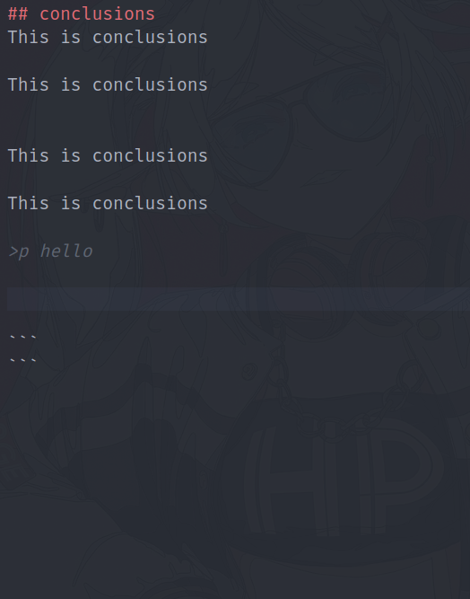

>s  vvv test variable

>s  report_number 1

>s student_last_name Lol

>s group test
    

## theme
>upper TEst Theme 1

## tasks
Завдання 1
Кон дпрограми:

>l  ../src/main.c

Результат роботи:

## conclusions111

>>p  Python

>l  ../src/main.c

>e  10 + 34

>upper TEst

>lower TEst

>lc  ../src/main.c
